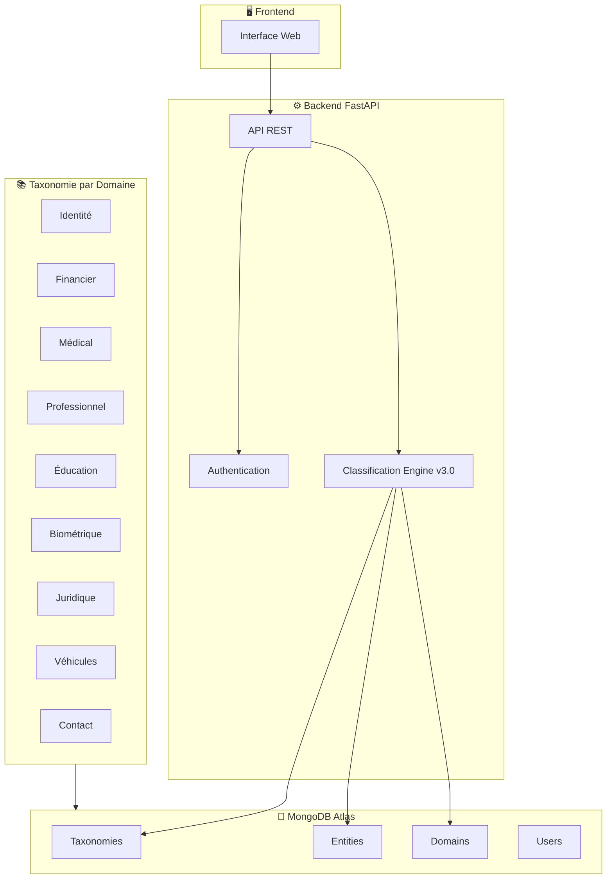
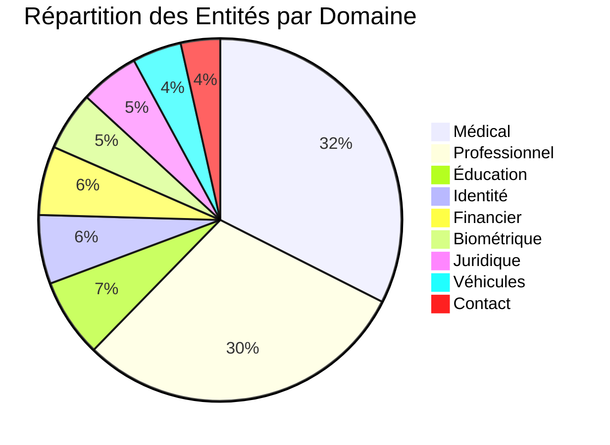
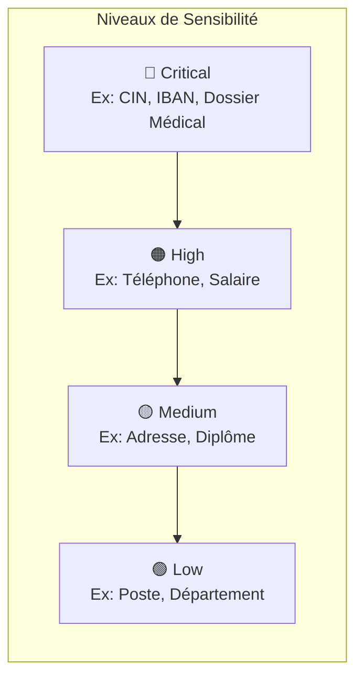

# 🏛️ DataGov - Plateforme de Gouvernance des Données

[](https://python.org)
[](https://fastapi.tiangolo.com)
[](https://mongodb.com)
[]()

> **Projet Fédérateur ENSIAS 2024-2025**  
> Plateforme de détection automatique des données sensibles (PII/SPI) et gouvernance des métadonnées avec Apache Atlas & Apache Ranger.

---

## 📋 Table des Matières

- [Objectif du Projet](#-objectif-du-projet)
- [Architecture](#️-architecture)
- [Taxonomie des Données](#-taxonomie-des-données)
- [Installation](#-installation)
- [Utilisation](#-utilisation)
- [Structure du Projet](#-structure-du-projet)
- [Prochaines Étapes](#-prochaines-étapes)
- [Équipe](#-équipe)

---

## 🎯 Objectif du Projet

Ce projet vise à développer une **plateforme de gouvernance des données** capable de :

1. **Détecter automatiquement** les données personnelles (PII) et sensibles (SPI) dans les fichiers
2. **Classifier** les données selon une taxonomie marocaine complète
3. **Intégrer avec Apache Atlas** pour la gestion des métadonnées
4. **Appliquer des politiques de sécurité** via Apache Ranger

---

## 🏗️ Architecture



---

## 📊 Taxonomie des Données

### Vue d'Ensemble

Notre taxonomie couvre **9 domaines** avec **114 entités** de données sensibles, spécifiquement adaptée au contexte **marocain**.



### Domaines de Données

| Domaine | Fichier | Entités | Type Principal | Exemples |
|---------|---------|---------|----------------|----------|
| 🏥 **Médical** | `medical.json` | 37 | SPI | Dossier médical, Diagnostic, Tests sérologiques |
| 💼 **Professionnel** | `professionnel.json` | 34 | PII/SPI | CNSS, Salaire, Évaluations, Sanctions |
| 🎓 **Éducation** | `education.json` | 8 | PII | Code Massar, CNE, Relevés de notes |
| 🪪 **Identité** | `identite.json` | 7 | SPI | CIN, Passeport, Date de naissance |
| 💳 **Financier** | `financier.json` | 7 | SPI | IBAN, Carte bancaire, CVV |
| 🔐 **Biométrique** | `biometrique.json` | 6 | SPI | Empreintes, Reconnaissance faciale, ADN |
| ⚖️ **Juridique** | `juridique.json` | 6 | SPI | Casier judiciaire, Jugements |
| 🚗 **Véhicules** | `vehicule.json` | 5 | PII | Immatriculation, Permis, VIN |
| 📞 **Contact** | `contact.json` | 4 | PII | Téléphone, Email, Adresse |

### Niveaux de Sensibilité



### Réglementations Supportées

- 🇲🇦 **Loi 09-08** (Protection des données personnelles - Maroc)
- 🇪🇺 **RGPD** (Règlement européen)
- 🏥 **HIPAA** (Données de santé)
- 💳 **PCI-DSS** (Données bancaires)
- 🏦 **Bank Al-Maghrib** (Réglementations bancaires)

---

## 🚀 Installation

### Prérequis

- Python 3.11+
- MongoDB Atlas (ou MongoDB local)
- Git

### Étapes d'Installation

```bash
# 1. Cloner le repository
git clone https://github.com/Yousseftouzani1/DataGovProjetFederateur.git
cd DataGovProjetFederateur

# 2. Changer vers la branche youssef_nisrine
git checkout youssef_nisrine

# 3. Créer et activer l'environnement virtuel
python -m venv venv
.\venv\Scripts\Activate.ps1  # Windows
# source venv/bin/activate   # Linux/Mac

# 4. Installer les dépendances
pip install -r requirements.txt
pip install pymongo motor pydantic dnspython fastapi uvicorn

# 5. Configurer les variables d'environnement
# Créer un fichier .env avec:
# MONGODB_URI=mongodb+srv://...
# DATABASE_NAME=DataGovDB

# 6. Charger les taxonomies dans MongoDB
python backend/database/taxonomy_loader.py

# 7. Lancer le serveur
python backend/taxonomie/classifier_v3.py
```

---

## 💻 Utilisation

### API Endpoints

| Endpoint | Méthode | Description |
|----------|---------|-------------|
| `/analyze` | POST | Analyser un texte pour détecter les données sensibles |
| `/health` | GET | Vérifier l'état du service |
| `/domains` | GET | Lister les domaines disponibles |
| `/categories` | GET | Lister les catégories de données |
| `/statistics` | GET | Obtenir les statistiques du moteur |

### Exemple d'Analyse

```bash
# Requête
curl -X POST http://127.0.0.1:8001/analyze \
  -H "Content-Type: application/json" \
  -d '{
    "text": "Mon CIN est AB123456, email: contact@gmail.com, tel: 0612345678",
    "anonymize": true,
    "domains": ["identite", "contact"]
  }'
```

```json
// Réponse
{
  "success": true,
  "detections_count": 3,
  "detections": [
    {
      "entity_type": "CIN - Carte d'Identité Nationale",
      "category": "IDENTITE_PERSONNELLE",
      "domain": "IDENTITE_DOCUMENTS_OFFICIELS",
      "value": "AB123456",
      "sensitivity_level": "critical"
    },
    {
      "entity_type": "Adresse email",
      "value": "contact@gmail.com",
      "sensitivity_level": "high"
    },
    {
      "entity_type": "Numéro de téléphone",
      "value": "0612345678",
      "sensitivity_level": "high"
    }
  ],
  "anonymized_text": "Mon CIN est [CIN_CARTE_D'IDENTITÉ_NATIONALE], email: [ADRESSE_EMAIL], tel: [NUMÉRO_DE_TÉLÉPHONE]"
}
```

### Documentation Interactive

Accédez à la documentation Swagger UI : **http://127.0.0.1:8001/docs**

---

## 📁 Structure du Projet

```
DataGovProjetFederateur/
├── 📂 backend/
│   ├── 📂 auth/                    # Authentification
│   ├── 📂 database/
│   │   ├── mongodb.py              # Connexion MongoDB Atlas
│   │   ├── taxonomy_schema.py      # Schémas Pydantic
│   │   └── taxonomy_loader.py      # Chargeur de taxonomies
│   ├── 📂 taxonomie/
│   │   ├── 📂 domains/             # ✨ NOUVEAU - Taxonomies par domaine
│   │   │   ├── identite.json
│   │   │   ├── contact.json
│   │   │   ├── financier.json
│   │   │   ├── professionnel.json
│   │   │   ├── medical.json
│   │   │   ├── education.json
│   │   │   ├── biometrique.json
│   │   │   ├── juridique.json
│   │   │   └── vehicule.json
│   │   ├── classifier.py           # Classifieur original (Manal)
│   │   ├── classifier_v3.py        # ✨ NOUVEAU - Classifieur v3 par domaine
│   │   └── taxonomie.json          # Taxonomie originale (Manal)
│   ├── 📂 users/                   # Gestion utilisateurs
│   └── 📂 data_ingestion/          # Ingestion de données
├── 📂 frontend/                    # Interface utilisateur
├── 📂 Taxonomy/                    # Fichiers de référence (CSV, PDF)
├── .env                            # Variables d'environnement
├── .gitignore
├── main.py                         # Point d'entrée FastAPI
├── requirements.txt
└── README.md
```

---

## 🔮 Prochaines Étapes

### Phase 1 : Amélioration du Classifieur ⏳
- [ ] Ajouter la détection par Machine Learning (NER)
- [ ] Supporter les fichiers CSV, Excel, PDF
- [ ] Améliorer la précision avec plus de patterns regex

### Phase 2 : Intégration Apache Atlas 📊
- [ ] Connecter à Apache Atlas pour la gestion des métadonnées
- [ ] Synchroniser les taxonomies avec le glossaire Atlas
- [ ] Créer des classifications automatiques

### Phase 3 : Politiques de Sécurité ⛑️
- [ ] Intégrer Apache Ranger pour les politiques d'accès
- [ ] Définir des règles de masquage par niveau de sensibilité
- [ ] Implémenter l'audit trail complet

### Phase 4 : Interface Utilisateur 🖥️
- [ ] Dashboard de visualisation des données sensibles
- [ ] Interface d'administration des taxonomies
- [ ] Rapports et exports

### Phase 5 : DevSecOps 🔒
- [ ] Pipeline CI/CD avec tests de sécurité
- [ ] Analyse statique du code (Bandit, Safety)
- [ ] Déploiement containerisé (Docker)

---

## 👥 Équipe

| Nom | Rôle |
|-----|------|
| **BAZZAOUI Younes** | Développeur |
| **ELGARCH Youssef** | Développeur (Taxonomie & MongoDB) |
| **IBNOU-KADY Nisrine** | Développeur (Taxonomie & MongoDB) |
| **TOUZANI Yousef** | Développeur |

### Encadrement
- **Professeur K. BAINA** - Encadrant académique
- **Dr. GASMI Manal** - Encadrant technique

---

## 📜 Licence

Projet académique - ENSIAS, Université Mohammed V de Rabat

---

<p align="center">
  Made with ❤️ at ENSIAS 2024-2025
</p>