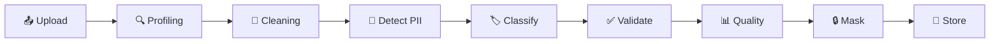

# 🛡️ DataGov - Système de Gouvernance des Données Sensibles

<div align="center">


**Plateforme intelligente de détection, classification et protection des données personnelles**

[🚀 Démarrage](#-démarrage-rapide) • [📋 Services](#-architecture-microservices) • [👥 Rôles](#-rôles-utilisateurs) • [📸 Démos](#-captures-décran) • [📖 Documentation](#-documentation)

</div>

---

## 🎯 Objectifs du Projet

Ce projet fédérateur vise à développer un **système complet de gouvernance des données sensibles** conforme aux réglementations :

- 🇪🇺 **RGPD** - Règlement Général sur la Protection des Données
- 🇲🇦 **Loi 09-08** - Protection des personnes physiques (Maroc)
- 📊 **ISO 25012** - Normes de qualité des données

---

## ✨ Fonctionnalités Principales

| Fonctionnalité | Description |
|----------------|-------------|
| 🔍 **Détection PII/SPI** | Identification automatique des données personnelles et sensibles |
| 🏷️ **Classification Fine-Grained** | Taxonomie hiérarchique multi-niveaux |
| 🔒 **Masquage Contextuel** | EthiMask - protection adaptative selon le rôle |
| 📈 **Scoring ISO** | Évaluation de la qualité des données |
| 🇲🇦 **Support Marocain** | CIN, CNSS, IBAN MA, Téléphone marocain |
| 🌍 **Multilingue** | Français, Anglais, Arabe |

---

## 🏗️ Architecture Microservices

```
┌─────────────────────────────────────────────────────────────────┐
│                        API Gateway (Nginx)                       │
└─────────────┬───────────────────────────────────┬───────────────┘
              │                                   │
┌─────────────▼───────────┐     ┌─────────────────▼───────────────┐
│    Frontend Dashboard    │     │         Apache Airflow          │
│     (Validation UI)      │     │       (Orchestration)           │
└─────────────┬───────────┘     └─────────────────┬───────────────┘
              │                                   │
┌─────────────▼───────────────────────────────────▼───────────────┐
│                     MICROSERVICES (FastAPI)                      │
├──────────────────────────────────────────────────────────────────┤
│  auth-serv      │  taxonomie-serv  │  presidio-serv              │
│  (Port 8001)    │  (Port 8002)     │  (Port 8003)                │
├─────────────────┼──────────────────┼─────────────────────────────┤
│  cleaning-serv  │  classification  │  correction-serv            │
│  (Port 8004)    │  (Port 8005)     │  (Port 8006)                │
├─────────────────┼──────────────────┼─────────────────────────────┤
│  annotation-srv │  quality-serv    │  ethimask-serv              │
│  (Port 8007)    │  (Port 8008)     │  (Port 8009)                │
└─────────────────┴──────────────────┴─────────────────────────────┘
              │                                   │
┌─────────────▼───────────┐     ┌─────────────────▼───────────────┐
│       MongoDB           │     │   Apache Atlas & Ranger          │
│     (Base de données)   │     │   (Gouvernance Big Data)         │
└─────────────────────────┘     └──────────────────────────────────┘
```

### 📦 Les 9 Services

| # | Service | Port | Tâche | Description |
|---|---------|------|-------|-------------|
| 1 | `auth-serv` | 8001 | Tâche 1 | Authentification JWT + Gestion des rôles |
| 2 | `taxonomie-serv` | 8002 | Tâche 2 | Taxonomie PII/SPI + Patterns regex marocains |
| 3 | `presidio-serv` | 8003 | Tâche 3 | Microsoft Presidio + Recognizers marocains |
| 4 | `cleaning-serv` | 8004 | Tâche 4 | Nettoyage et profilage des données |
| 5 | `classification-serv` | 8005 | Tâche 5 | Classification ML/NLP (HuggingFace) |
| 6 | `correction-serv` | 8006 | Tâche 6 | Correction automatique des incohérences |
| 7 | `annotation-serv` | 8007 | Tâche 7 | Workflow de validation humaine |
| 8 | `quality-serv` | 8008 | Tâche 8 | Métriques ISO 25012 |
| 9 | `ethimask-serv` | 8009 | Tâche 9 | Masquage contextuel (Perceptron) |

---

## 👥 Rôles Utilisateurs

Le système définit **4 rôles principaux** avec des permissions spécifiques :

### 🔴 **Admin**
- Gestion complète du système
- Configuration des politiques Ranger
- Supervision de tous les services
- Accès aux données non masquées

### 🟠 **Data Steward**
- Approuver les corrections majeures
- Définir les règles de qualité
- Gérer la taxonomie
- Accès au dashboard de gouvernance

### 🟡 **Data Annotator**
- Valider les classifications automatiques
- Enrichir les métadonnées
- Corriger les anomalies détectées
- Modification des annotations

### 🟢 **Data Labeler**
- Annoter les données brutes
- Confirmer/corriger les détections PII
- Labelliser la sensibilité
- Lecture seule (pas de modification structure)

---

## 📸 Captures d'Écran

### 🖥️ Dashboard Principal


### 🔍 Détection d'Identité


### 🔒 Anonymisation


### 🌍 Support Arabe


### 📊 Résumé des Détections


---

## 🚀 Démarrage Rapide

### Prérequis

```bash
Python >= 3.9
MongoDB >= 6.0
Docker & Docker Compose (optionnel)
```

### Installation

```bash
# 1. Cloner le repository
git clone https://github.com/Yousseftouzani1/DataGovProjetFederateur.git
cd DataGovProjetFederateur

# 2. Créer un environnement virtuel
python -m venv venv
source venv/bin/activate  # Linux/Mac
venv\Scripts\activate     # Windows

# 3. Installer les dépendances
pip install -r requirements.txt

# 4. Configurer les variables d'environnement
cp .env.example .env
# Éditer .env avec vos paramètres MongoDB
```

### Lancer un Service

```bash
# Taxonomie Service
cd services/taxonomie-serv
python main.py  # → http://localhost:8002

# Presidio Service
cd services/presidio-serv
python main.py  # → http://localhost:8003

# Classification Service
cd services/classification-serv
python main.py  # → http://localhost:8005
```

### Avec Docker

```bash
docker-compose up -d
```

---

## 📁 Structure du Projet

```
DataGovProjetFederateur/
├── services/                    # 🔧 Microservices
│   ├── auth-serv/              # Authentification
│   ├── taxonomie-serv/         # Taxonomie PII/SPI
│   ├── presidio-serv/          # Presidio Maroc
│   ├── cleaning-serv/          # Nettoyage données
│   ├── classification-serv/    # Classification ML
│   ├── correction-serv/        # Correction auto
│   ├── annotation-serv/        # Validation humaine
│   ├── quality-serv/           # Qualité ISO
│   └── ethimask-serv/          # Masquage contextuel
├── airflow/                     # 🔄 Orchestration DAGs
├── atlas_integration/           # 🗂️ Apache Atlas
├── ranger_integration/          # 🔐 Apache Ranger
├── datasets/                    # 📊 Données de test
├── docs/                        # 📖 Documentation
└── scripts/                     # 🛠️ Scripts utilitaires
```

---

## 🔒 Recognizers Marocains (Presidio)

Le service `presidio-serv` inclut des **recognizers personnalisés** pour le contexte marocain :

| Recognizer | Pattern | Exemple |
|------------|---------|---------|
| `CIN_MAROC` | `[A-Z]{1,2}\d{5,8}` | AB123456, J654321 |
| `PHONE_MA` | `(+212\|00212\|0)[5-7]\d{8}` | +212612345678 |
| `IBAN_MA` | `MA\d{24}` | MA64011007850001230000 |
| `CNSS_MA` | `\d{9,12}` (avec contexte) | 123456789012 |

---

## 📋 Workflow de Traitement



---

## 📖 Documentation

- 📋 [Cahier des Charges](docs/Cahier_des_Charges_Projet_Fédérateur.pdf)
- 📐 [Guide Qualité](docs/Guide_Qualité_Projet_Fédérateur.pdf)
- 🔧 [API Documentation](http://localhost:8002/docs) (Swagger)

---

## 🧪 Tests

```bash
# Exécuter tous les tests
pytest tests/

# Avec couverture
pytest --cov=services tests/
```

---

## 📊 KPIs du Projet

| Métrique | Objectif |
|----------|----------|
| Précision détection PII | > 95% |
| Temps traitement 1000 lignes | < 5s |
| Score qualité ISO | > 85/100 |
| Couverture tests | > 80% |

---

## 👨‍💻 Équipe

**Encadrants :**
| Rôle | Nom |
|------|-----|
| Encadrante technique | Dr. GASMI Manal |
| Encadrant académique | Pr. K. BAINA |

**Équipe de développement :**
| Membre |
|--------|
| BAZZAOUI Younes |
| ELGARCH Youssef |
| IBNOU-KADY Nisrine |
| TOUZANI Youssef |

---

## 📜 Licence

Ce projet est développé dans le cadre du **Projet Fédérateur 2024-2025** - Data Governance & Privacy.

---

<div align="center">

**Made with ❤️ for Data Governance**

[⬆ Retour en haut](#️-datagov---système-de-gouvernance-des-données-sensibles)

</div>
