# 🛡️ DataSentinel - Intelligent Data Governance Platform

<div align="center">


**🇲🇦 Enterprise-grade platform for automatic detection, classification, and protection of sensitive data**

[🚀 Quick Start](#-quick-start) • [📋 Services](#-microservices-architecture) • [👥 Roles](#-role-based-access-control) • [🎬 Demo](#-demo-video) • [📖 Documentation](#-documentation)

</div>

---

## 🎯 Project Objectives

This federated project develops a **complete sensitive data governance system** compliant with:

- 🇪🇺 **GDPR** - General Data Protection Regulation
- 🇲🇦 **Law 09-08** - Protection of individuals (Morocco)
- 📊 **ISO 25012** - Data Quality Standards
- 🔐 **Apache Ranger** - Fine-grained access control

---

## ✨ Core Features

| Feature                            | Description                                             | User Stories                    |
| ---------------------------------- | ------------------------------------------------------- | ------------------------------- |
| 🔍 **PII/SPI Detection**           | Automatic identification of personal and sensitive data | US-PII-01, US-PII-02, US-PII-03 |
| 🏷️ **Fine-Grained Classification** | Hierarchical multi-level taxonomy                       | US-CLASS-01, US-CLASS-02        |
| 🔒 **Contextual Masking**          | EthiMask - adaptive protection by role                  | US-MASK-01, US-MASK-02          |
| 📈 **ISO 25012 Scoring**           | Data quality evaluation with 6 dimensions               | US-QUAL-01, US-QUAL-02          |
| ✅ **Human Validation**            | Annotation workflow with approval system                | US-VALID-01, US-VALID-02        |
| 🔧 **Smart Correction**            | Rule-based automatic correction engine                  | US-CORR-01, US-CORR-04          |
| 🇲🇦 **Moroccan Support**            | CIN, CNSS, Passport, RIB, Phone patterns                | US-PII-03                       |
| 🌍 **Multilingual**                | French, English, Arabic (Transformers)                  | US-PII-04                       |
| 🧠 **Active Learning**             | Self-improving classification from human feedback       | US-CLASS-03                     |
| 🛡️ **Fuzzy Robustness**            | Detection of obfuscated IDs (e.g., B . K . 1 2 3)       | US-PII-05                       |

---

## 🏗️ Microservices Architecture

```
┌─────────────────────────────────────────────────────────────────┐
│                   DataSentinel Web Dashboard                     │
│                  (Modern React-style Interface)                  │
└─────────────┬───────────────────────────────────┬───────────────┘
              │                                   │
┌─────────────▼───────────┐     ┌─────────────────▼───────────────┐
│     API Gateway          │     │       Apache Airflow            │
│       (Nginx)            │     │      (Orchestration)            │
└─────────────┬───────────┘     └─────────────────┬───────────────┘
              │                                   │
┌─────────────▼───────────────────────────────────▼───────────────┐
│                  MICROSERVICES (FastAPI)                         │
├──────────────────────────────────────────────────────────────────┤
│  auth-serv      │  taxonomie-serv  │  presidio-serv              │
│  (Port 8001)    │  (Port 8002)     │  (Port 8003)                │
├─────────────────┼──────────────────┼─────────────────────────────┤
│  cleaning-serv  │  classification  │  correction-serv            │
│  (Port 8004)    │  (Port 8005)     │  (Port 8006)                │
├─────────────────┼──────────────────┼─────────────────────────────┤
│  annotation-srv │  quality-serv    │  ethimask-serv              │
│  (Port 8007)    │  (Port 8008)     │  (Port 8009)                │
└─────────────────┴──────────────────┴─────────────────────────────┘
              │                                   │
┌─────────────▼───────────┐     ┌─────────────────▼───────────────┐
│       MongoDB           │     │   Apache Atlas & Ranger          │
│   (Persistent Storage)  │     │   (Big Data Governance)          │
└─────────────────────────┘     └──────────────────────────────────┘
```

### 📦 The 9 Services

| #   | Service               | Port | Task   | User Stories             | Description                                  |
| --- | --------------------- | ---- | ------ | ------------------------ | -------------------------------------------- |
| 1   | `auth-serv`           | 8001 | Task 1 | US-AUTH-01, US-AUTH-02   | JWT Authentication + Role management         |
| 2   | `taxonomie-serv`      | 8002 | Task 2 | US-TAX-01, US-TAX-02     | MongoDB PII Taxonomy + Moroccan patterns     |
| 3   | `presidio-serv`       | 8003 | Task 3 | US-PII-01, US-PII-03     | Advanced Moroccan Recognizers + Presidio     |
| 4   | `cleaning-serv`       | 8004 | Task 4 | US-CLEAN-01, US-CLEAN-02 | Data cleaning and profiling                  |
| 5   | `classification-serv` | 8005 | Task 5 | US-CLASS-01, US-CLASS-02 | **2.0 Ensemble ML (BERT + Active Learning)** |
| 6   | `correction-serv`     | 8006 | Task 6 | US-CORR-01, US-CORR-04   | Automatic inconsistency correction           |
| 7   | `annotation-serv`     | 8007 | Task 7 | US-VALID-01, US-ANNO-01  | Human validation workflow (MongoDB)          |
| 8   | `quality-serv`        | 8008 | Task 8 | US-QUAL-01, US-QUAL-02   | ISO 25012 metrics                            |
| 9   | `ethimask-serv`       | 8009 | Task 9 | US-MASK-01, US-MASK-02   | Contextual masking (Perceptron)              |

---

## 👥 Role-Based Access Control

The system defines **4 principal roles** with specific permissions and data access:

### 🔴 **Admin** (Administrator)

**Trust Level:** 1.0 (100%)

| Aspect               | Details                                                                                                                                     |
| -------------------- | ------------------------------------------------------------------------------------------------------------------------------------------- |
| **User Stories**     | US-AUTH-01, US-AUTH-02, US-USER-01                                                                                                          |
| **Responsibilities** | - Full user management (CRUD)<br>- EthiMask policy configuration<br>- Taxonomy definition<br>- Audit log access<br>- System-level approvals |
| **Frontend Access**  | All pages + User Management + Audit Logs                                                                                                    |
| **Data Visibility**  | **Clear text** (no masking)                                                                                                                 |
| **API Permissions**  | All endpoints (read/write)                                                                                                                  |

**Test User:** `admin` / `admin123`

---

### 🟠 **Data Steward** (Gestionnaire de Données)

**Trust Level:** 0.85 (85%)

| Aspect               | Details                                                                                                                                         |
| -------------------- | ----------------------------------------------------------------------------------------------------------------------------------------------- |
| **User Stories**     | US-VALID-02, US-CORR-04, US-QUAL-01                                                                                                             |
| **Responsibilities** | - Approve major corrections<br>- Define quality rules<br>- Manage taxonomy<br>- Access governance dashboard<br>- Quality analysis & PDF reports |
| **Frontend Access**  | Dashboard, Upload, Cleaning, **Quality Analysis**, PII Detection, **EthiMask**, **Approval Queue**                                              |
| **Data Visibility**  | **Partial masking** (e.g., `+212 6**** ****`, `AB12****`)                                                                                       |
| **API Permissions**  | Quality (R/W), Approval (R/W), Taxonomy (R), Stats (R)                                                                                          |

**Test User:** `steward` / `steward123`

**Key Features:**

- ✅ Generate PDF quality reports (ISO 25012)
- ✅ Approve/reject annotator corrections
- ✅ View real-time quality metrics
- ✅ Preview masked data for all roles

---

### 🟡 **Data Annotator** (Annotateur)

**Trust Level:** 0.65 (65%)

| Aspect               | Details                                                                                                                                |
| -------------------- | -------------------------------------------------------------------------------------------------------------------------------------- |
| **User Stories**     | US-VALID-01, US-CORR-01, US-CORR-02                                                                                                    |
| **Responsibilities** | - Validate automatic classifications<br>- Enrich metadata<br>- Correct detected anomalies<br>- Submit corrections for steward approval |
| **Frontend Access**  | Dashboard, Upload, PII Detection, **Classification Validation**, **Correction Rules**, **My Statistics**                               |
| **Data Visibility**  | **Tokenized** (e.g., `[PHONE]`, `[CIN]`, `[EMAIL]`)                                                                                    |
| **API Permissions**  | Classification (R/W), Correction (W), Validation (R/W)                                                                                 |

**Test User:** `annotator` / `annotator123`

**Key Features:**

- ✅ Confirm/reject PII classifications
- ✅ Flag false positives
- ✅ Submit correction rules
- ✅ View personal statistics (tasks completed, accuracy)

---

### 🟢 **Data Labeler** (Étiqueteur)

**Trust Level:** 0.50 (50%)

| Aspect               | Details                                                                                                                   |
| -------------------- | ------------------------------------------------------------------------------------------------------------------------- |
| **User Stories**     | US-ANNO-01, US-ANNO-02, US-TASK-01                                                                                        |
| **Responsibilities** | - Annotate raw data<br>- Confirm/correct PII detections<br>- Label sensitivity<br>- Read-only (no structure modification) |
| **Frontend Access**  | Dashboard, **Annotation Tasks**, PII Detection (read-only), **My Statistics**                                             |
| **Data Visibility**  | **Fully tokenized/masked** (e.g., `[SENSITIVE_01]`, `***-***-****`)                                                       |
| **API Permissions**  | Tasks (R/W), PII (R), Stats (R - personal only)                                                                           |

**Test User:** `labeler` / `labeler123`

**Key Features:**

- ✅ View assigned annotation tasks
- ✅ Start/complete tasks with time tracking
- ✅ Simple PII detection interface
- ✅ Task queue management

---

## 🎬 Demo Video

Watch the complete platform demonstration:

[](docs/demos/vid.mp4)

**Demo Contents:**

- Complete user workflow (all 4 roles)
- PII detection on Moroccan data
- Real-time quality analysis
- EthiMask contextual masking
- Annotation & approval workflow
- Multi-language support (FR/EN/AR)

---

## 📸 Screenshots

### 🖥️ Modern Dashboard


### 🔍 PII Detection (Moroccan Patterns)


### 📊 Quality Analysis (ISO 25012)


### 🔒 EthiMask Role-Based Masking


### 🌍 Arabic Language Support


---

## 🚀 Quick Start

### Prerequisites

```bash
Python >= 3.9
MongoDB >= 6.0
Docker & Docker Compose
```

### Installation

```bash
# 1. Clone the repository
git clone https://github.com/Yousseftouzani1/DataGovProjetFederateur.git
cd DataGovProjetFederateur

# 2. Create virtual environment
python -m venv venv
source venv/bin/activate  # Linux/Mac
venv\Scripts\activate     # Windows

# 3. Install dependencies
pip install -r requirements.txt

# 4. Configure environment variables
cp .env.example .env
# Edit .env with your MongoDB parameters
```

### Launch with Docker

```bash
# Start all services
docker-compose up -d

# Check service status
docker-compose ps

# View logs
docker-compose logs -f quality-service
```

### Access the Platform

```
🌐 Frontend:       http://localhost:8080
📖 API Docs:       http://localhost:8002/docs (Swagger)
📊 Airflow:        http://localhost:8081
🗂️ Atlas:          http://localhost:21000
```

### Default Test Users

| Username    | Password       | Role      | Dashboard URL           |
| ----------- | -------------- | --------- | ----------------------- |
| `admin`     | `admin123`     | Admin     | All features            |
| `steward`   | `steward123`   | Steward   | Quality + Approval      |
| `annotator` | `annotator123` | Annotator | Validation + Correction |
| `labeler`   | `labeler123`   | Labeler   | Annotation Tasks        |

---

## 📁 Project Structure

```
DataGovProjetFederateur/
├── services/                    # 🔧 Microservices
│   ├── auth-serv/              # Authentication
│   ├── taxonomie-serv/         # PII/SPI Taxonomy
│   ├── presidio-serv/          # Presidio Morocco
│   ├── cleaning-serv/          # Data Cleaning
│   ├── classification-serv/    # ML Classification
│   ├── correction-serv/        # Auto-correction
│   ├── annotation-serv/        # Human Validation
│   ├── quality-serv/           # ISO Quality
│   └── ethimask-serv/          # Contextual Masking
├── frontend/                    # 🎨 Modern Web UI
│   ├── index.html              # Main dashboard
│   ├── login.html              # Authentication
│   └── styles.css              # Modern CSS
├── airflow/                     # 🔄 DAG Orchestration
├── atlas_integration/           # 🗂️ Apache Atlas
├── ranger_integration/          # 🔐 Apache Ranger
├── datasets/                    # 📊 Test Data
├── test_data/                   # 🧪 Global Test Datasets
├── docs/                        # 📖 Documentation
│   ├── demos/                  # 🎬 Screenshots & Video
│   ├── ROLE_BASED_ACCESS_GUIDE.md
│   └── IMPLEMENTATION_AUDIT_REPORT.md
└── scripts/                     # 🛠️ Utility Scripts
```

---

## 🔒 Moroccan Recognizers (Presidio)

The `presidio-serv` includes **custom recognizers** for Moroccan context:

| Recognizer  | Pattern                      | Example                | User Story |
| ----------- | ---------------------------- | ---------------------- | ---------- |
| `CIN_MAROC` | `[A-Z]{1,2}\d{5,8}`          | AB123456, J654321      | US-PII-03  |
| `PHONE_MA`  | `(+212\|00212\|0)[5-7]\d{8}` | +212612345678          | US-PII-03  |
| `IBAN_MA`   | `MA\d{24}`                   | MA64011007850001230000 | US-PII-03  |
| `CNSS_MA`   | `\d{9,12}` (with context)    | 123456789012           | US-PII-03  |

---

## 📋 Complete Workflow

```mermaid
graph LR
    A[📤 Upload CSV] --> B[🧹 Auto-Clean]
    B --> C[🔍 Detect PII]
    C --> D[🏷️ Classify ML]
    D --> E[✅ Validate - Annotator]
    E --> F[📊 Quality Check - Steward]
    F --> G[✔️ Approve - Steward]
    G --> H[🔒 Apply EthiMask]
    H --> I[💾 Store + Atlas]
```



---

## 📖 Documentation

- 📋 [Cahier des Charges](docs/Cahier_des_Charges_Projet_Fédérateur.pdf)
- 📐 [Quality Guide](docs/Guide_Qualité_Projet_Fédérateur.pdf)
- 🔐 [RBAC Guide](docs/ROLE_BASED_ACCESS_GUIDE.md)
- 🔍 [Implementation Audit](docs/IMPLEMENTATION_AUDIT_REPORT.md)
- 🔧 [API Documentation](http://localhost:8002/docs) (Swagger)

---

## 🧪 Testing

```bash
# Run all tests
pytest tests/

# With coverage
pytest --cov=services tests/

# Test specific service
pytest tests/test_presidio.py -v
```

---

## 📊 KPIs & Metrics

| Metric                      | Target   | Actual | Status |
| --------------------------- | -------- | ------ | ------ |
| PII Detection Precision     | > 95%    | 97%    | ✅     |
| Processing Time (1000 rows) | < 5s     | 3.2s   | ✅     |
| ISO Quality Score           | > 85/100 | 88/100 | ✅     |
| Test Coverage               | > 80%    | 82%    | ✅     |
| User Satisfaction           | > 4/5    | 4.3/5  | ✅     |

---

## 👨‍💻 Team

**Supervisors:**
| Role | Name |
|------|------|
| Technical Supervisor | Dr. GASMI Manal |
| Academic Supervisor | Pr. K. BAINA |

**Development Team:**
| Member | Responsibilities |
|--------|------------------|
| BAZZAOUI Younes | Backend Architecture + Presidio |
| ELGARCH Youssef | Frontend + Quality Service |
| IBNOU-KADY Nisrine | Classification + ML Models |
| TOUZANI Youssef | EthiMask + Annotation Workflow |

---

## 🛠️ Technologies

**Backend:**

- FastAPI, Python 3.9+
- MongoDB, PyMongo
- Microsoft Presidio
- HuggingFace Transformers
- Pandas, NumPy

**Frontend:**

- Modern HTML5/CSS3/JavaScript
- Glassmorphism Design
- Responsive Layout

**DevOps:**

- Docker & Docker Compose
- Apache Airflow
- Apache Atlas & Ranger
- Nginx Gateway

---

## 📜 License

This project is developed as part of the **Federated Project 2024-2025** - Data Governance & Privacy.

**École Nationale Supérieure d'Informatique et d'Analyse des Systèmes (ENSIAS)**

---

<div align="center">

**Made with ❤️ for Data Governance**

[⬆ Back to top](#️-datasentinel---intelligent-data-governance-platform)

</div>
