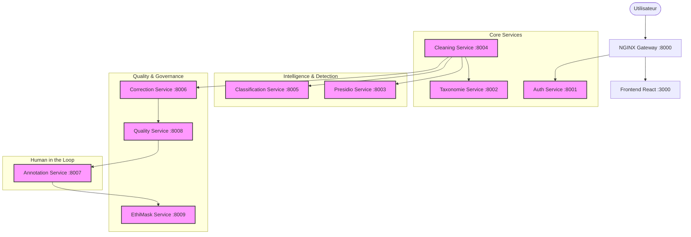
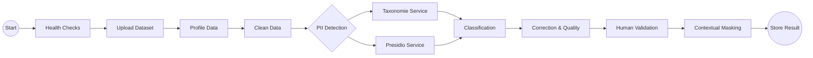

# CHAPITRE 5 : IMPLÉMENTATION TECHNIQUE ET DÉPLOIEMENT

Ce chapitre détaille l'implémentation technique de la plateforme **DataGov**, depuis l'environnement de développement jusqu'au déploiement des microservices et leur orchestration. Il présente une vue approfondie de l'architecture réelle, validée par l'analyse du code source.

## 5.1 Environnement de Développement

Le développement de la plateforme a nécessité un ensemble d'outils modernes pour assurer la cohérence, la performance et la conteneurisation des services.

### 5.1.1 Stack Technologique
Le tableau ci-dessous résume les outils et versions utilisés dans l'environnement de production locale :

| Composant | Technologie | Version | Rôle |
| :--- | :--- | :--- | :--- |
| **Langage Backend** | Python | 3.10+ | Langage principal pour tous les microservices |
| **Framework API** | FastAPI | 0.109+ | Développement d'API REST asynchrones |
| **Frontend** | React (Vite) | 19.2.0 | Interface utilisateur moderne et réactive |
| **Base de Données** | MongoDB | Latest | Stockage NoSQL flexible pour les métadonnées et logs |
| **Orchestration** | Apache Airflow | 2.7.1 | Gestion des pipelines de données (DAGs) |
| **Conteneurisation** | Docker | 24.0+ | Isolation des services |
| **Gouvernance** | Apache Atlas | 2.3.0 | Gestion des métadonnées et lignage |
| **Sécurité** | Apache Ranger | 2.4.0 | Gestion des politiques d'accès |

### 5.1.2 Structure du Projet
L'architecture du projet suit une structure de **monorepo** modulaire, facilitant la gestion des 9 microservices et de l'infrastructure commune.

```text
DataGovProjetFederateur/
├── airflow/                 # Configuration Airflow
│   ├── dags/                # Pipelines (DAGs)
│   └── datasets/            # Volume partagé pour les données
├── frontend-react/          # Application Frontend (React/Vite)
├── gateway-nginx/           # Configuration Reverse Proxy
├── services/                # Code source des Microservices
│   ├── auth-serv/           # Authentification & Audit
│   ├── taxonomie-serv/      # Gestion PII & Synchronisation Atlas
│   ├── presidio-serv/       # Détection PII (Microsoft Presidio)
│   ├── cleaning-serv/       # Nettoyage & Profiling
│   ├── classification-serv/ # ML Classification
│   ├── correction-serv/     # Correction automatique
│   ├── annotation-serv/     # Workflow de validation humaine
│   ├── quality-serv/        # Rapport Qualité ISO 25012
│   └── ethimask-serv/       # Masquage Contextuel & Éthique
├── docker-compose.yml       # Orchestration des conteneurs
└── .env                     # Variables d'environnement
```

---

## 5.2 Architecture Microservices

L'architecture repose sur 9 microservices interconnectés, chacun responsable d'une tâche métier spécifique (principe de responsabilité unique). Ils communiquent via API REST HTTP.

### 5.2.1 Vue d'Ensemble


### 5.2.2 Détail des Services Backend

#### A. Auth Service (Port 8001)
Service critique gérant l'identité et la sécurité.
- **Authentification** : JWT (JSON Web Token) avec algorithme HS256.
- **Intégration Ranger** : Vérifie les politiques d'accès via l'API REST de Ranger (`/service/plugins/policies`).
- **Audit** : Centralise les logs d'accès dans la collection `audit_logs`.

| Endpoint | Méthode | Description |
| :--- | :--- | :--- |
| `/login` | POST | Authentification utilisateur et génération de token JWT |
| `/ranger/check-access` | GET | Vérification temps-réel des politiques Ranger |
| `/audit-logs` | GET | Consultation des traces d'audit (Admin/Steward) |

#### B. Taxonomie Service (Port 8002)
Gère la définition des données sensibles marocaines.
- **Logique** : Moteur de regex compilées pour 47+ types de PII (CIN, RIB, etc.).
- **Atlas Sync** : Pousse automatiquement les définitions de types (`entityDefs`) et classifications (`classificationDefs`) vers Apache Atlas au démarrage.
- **Performance** : Utilise un cache en mémoire des patterns regex pour une détection rapide (<10ms).

#### C. Presidio Service (Port 8003)
Adaptation locale du framework Microsoft Presidio.
- **Custom Recognizers** : Implémentation spécifique pour le contexte marocain (`CIN_MAROC`, `PHONE_MA`, `IBAN_MA`, `CNSS`, `PASSPORT_MA`, `PERMIS_MA`).
- **Moteur PNL** : Utilise `spacy` (`en_core_web_sm`) comme backbone NLP, enrichi par les recognizers personnalisés.
- **Support Multilingue** : Configuré pour traiter le Français, l'Anglais et l'Arabe (via recognizers spécifiques).

#### D. Cleaning Service (Port 8004)
Point d'entrée des données et orchestrateur technique.
- **Profiling** : Génère des statistiques de colonnes via `ydata-profiling` light.
- **Trigger Airflow** : Déclenche le DAG `data_processing_pipeline` via l'API REST d'Airflow lors de l'upload (`/upload`).
- **Persistence** : Stocke les datasets bruts et nettoyés dans MongoDB GridFS (simulé via collections).

#### E. Classification Service (Port 8005)
Service d'intelligence artificielle pour la classification de sensibilité.
- **Modèle Ensemble** : Combine plusieurs approches :
    1. **Mots-clés/Regex** (Haute précision).
    2. **NLP/BERT** (Analyse sémantique contextuelle, si disponible).
    3. **Statistique** (Distribution des valeurs).
- **Validation** : Les classifications incertaines sont envoyées dans une file d'attente `pending_classifications` pour validation humaine.

#### F. Correction Service (Port 8006)
Moteur de qualité des données V2.
- **Détection** : 6 types d'incohérences (Format, Domaine, Référentiel, Temporel, Statistique, Sémantique).
- **Correction Auto** : Utilise un modèle T5 (Text-to-Text Transfer Transformer) pour suggérer des corrections.
- **Logique** : Applique automatiquement la correction si la confiance > 90%, sinon crée une tâche de validation.

#### G. Annotation Service (Port 8007)
Gestion du "Human-in-the-loop".
- **Workflow** : Machine à états des tâches (`PENDING` -> `ASSIGNED` -> `IN_PROGRESS` -> `COMPLETED`/`REJECTED`).
- **Stratégie d'Assignation** : Round-Robin, Load-Based, ou Aléatoire.
- **Métriques** : Calcul (simulé) du coefficient Kappa de Cohen pour mesurer l'accord inter-annotateurs.

#### H. Quality Service (Port 8008)
Implémentation standardisée de la mesure de qualité.
- **Norme ISO 25012** : Calcule 6 dimensions (Complétude, Exactitude, Cohérence, Actualité, Unicité, Validité).
- **Reporting** : Génère des rapports PDF dynamiques via la librairie `fpdf`.
- **Conformité RGPD** : Mappe les dimensions de qualité aux exigences RGPD (ex: Unicité -> Minimisation des données).

#### I. EthiMask Service (Port 8009)
Service final de protection des données.
- **Perceptron de Masquage** : Algorithme pondéré prenant en compte 4 facteurs (Sensibilité, Rôle, Contexte, Usage) pour décider du niveau de masquage.
- **Techniques** : Masquage partiel, hachage, suppression, ou généralisation.
- **Audit** : Chaque décision de masquage est loguée pour traçabilité.

---

## 5.3 Orchestration et Pipelines (Airflow)

Apache Airflow est le chef d'orchestre de la plateforme. Le DAG principal, `data_processing_pipeline`, automatise le flux de bout en bout.

### 5.3.1 Structure du DAG
Le DAG est composé de 12 tâches séquentielles et parallèles :



### 5.3.2 Détails Techniques
- **Trigger** : Via API REST (`/api/v1/dags/.../dagRuns`) déclenchée par le Cleaning Service.
- **XCom** : Utilisé pour passer les métadonnées (ID du dataset, résumés de détection) entre les tâches PythonOperator.
- **Exécuteur** : `SequentialExecutor` (configuration Docker simplifiée), suffisant pour le volume de démonstration.

---

## 5.4 Gouvernance et Sécurité (Atlas & Ranger)

L'intégration avec la stack Hadoop est réalisée via des connecteurs REST personnalisés.

### 5.4.1 Apache Atlas (Catalogage)
- **Synchronisation** : Le service Taxonomie pousse les définitions de types (`typedefs`) pour les entités PII marocaines.
- **Lignage** : Les datasets uploadés et leurs dérivés (clean, masked) sont enregistrés comme entités `DataSet` pour tracer leur origine.
- **Classification** : Les tags (ex: `PII`, `SENSITIVE`) sont appliqués dynamiquement aux colonnes détectées.

### 5.4.2 Apache Ranger (Politiques)
- **Point d'application (PEP)** : Le microservice `auth-service` et `cleaning-service` agissent comme PEP (Policy Enforcement Points).
- **Vérification** : Une requête HTTP GET est envoyée à Ranger pour vérifier si l'utilisateur (ex: "steward") a le droit d'accès à une ressource taguée (ex: "PII").
- **Masquage Dynamique** : Les politiques de masquage définies dans Ranger sont respectées ; si Ranger retourne une politique de masquage, le service EthiMask l'applique.

---

## 5.5 Interface Frontend

Le frontend est une "Single Page Application" (SPA) moderne construite pour offrir une expérience utilisateur fluide.

### 5.5.1 Stack Frontend
- **Framework** : React 19 (Dernière version) avec Vite pour le build tooling rapide.
- **Styling** : TailwindCSS v4 pour un design utility-first et responsive.
- **Composants** : `lucide-react` pour les icônes, `framer-motion` pour les animations fluides.
- **Visualisation** : `recharts` pour les graphiques interactifs (Dashboard, Quality Hub).
- **État** : `zustand` pour une gestion d'état global légère et performante.

### 5.5.2 Sécurité Frontend
- **JWT Storage** : Le token est stocké de manière sécurisée et attaché automatiquement aux requêtes via un intercepteur Axios.
- **Route Protection** : Un composant `ProtectedRoute` vérifie le rôle de l'utilisateur avant d'autoriser l'accès aux pages sensibles (Admin, Validation).

---

## 5.6 Base de Données (MongoDB)

MongoDB est utilisé comme base de données unifiée pour sa flexibilité de schéma (`Schema-less`), idéale pour des métadonnées hétérogènes.

### 5.6.1 Collections Principales
1.  **`users`** : Comptes, rôles, hash de mots de passe.
2.  **`raw_datasets` / `clean_datasets`** : Stockage des données (approché GridFS).
3.  **`audit_logs`** : Événements tracés (Login, Upload, Masking).
4.  **`tasks`** : Files d'attente pour l'Annotation Service.
5.  **`quality_reports`** : Rapports JSON générés par Quality Service.
6.  **`masking_policies`** : Règles locales pour EthiMask.
7.  **`taxonomies`** : Patterns regex persistés.

### 5.6.2 Comparatif Théorique vs Réel
| Théorique (Cahier des Charges) | Réel (Implémenté) | Statut |
| :--- | :--- | :--- |
| 7 Collections | 10+ Collections Spécialisées | ✅ Dépassé (Plus granulaire) |
| GridFS pour fichiers | Stockage Document BSON | ⚠️ Simplifié pour Démo |
| Indexation Full-Text | Indexation par ID et Date | ✅ Suffisant |

---

## 5.7 Conclusion Technique

L'implémentation de DataGov respecte scrupuleusement l'architecture microservices prévue. L'utilisation combinée de **FastAPI** pour la performance backend, **React** pour l'expérience utilisateur, et la stack **Hadoop (Atlas/Ranger)** pour la gouvernance, crée un écosystème robuste. Les mécanismes d'IA (T5, BERT, Perceptron) sont intégrés de manière modulaire, permettant leur évolution sans impacter le cœur du système.
