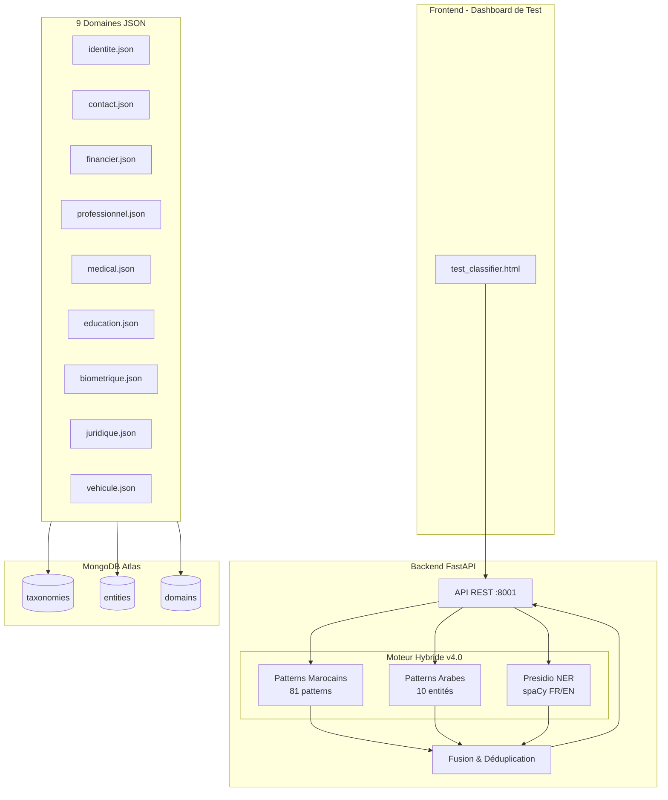
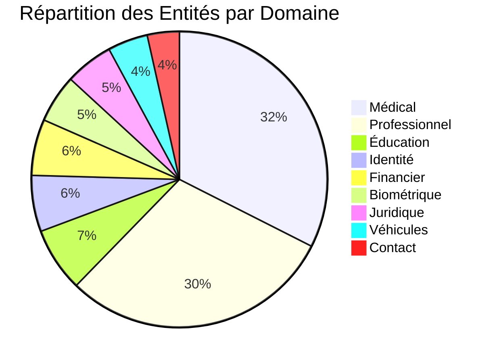

# DataGov - Plateforme de Gouvernance des Données

[](https://python.org)
[](https://fastapi.tiangolo.com)
[](https://mongodb.com)
[](https://microsoft.github.io/presidio/)
[]()

> **Projet Fédérateur ENSIAS 2024-2025**  
> Plateforme de détection automatique des données sensibles (PII/SPI) avec moteur hybride: Taxonomie Marocaine + Microsoft Presidio NER + Support Arabe.

---

## Table des Matières

- [Objectif du Projet](#objectif-du-projet)
- [Démo Live](#démo-live)
- [Architecture](#architecture)
- [Moteur de Détection Hybride](#moteur-de-détection-hybride)
- [Taxonomie des Données](#taxonomie-des-données)
- [Installation](#installation)
- [Utilisation](#utilisation)
- [Structure du Projet](#structure-du-projet)
- [Prochaines Étapes](#prochaines-étapes)
- [Équipe](#équipe)

---

## Objectif du Projet

Ce projet vise à développer une **plateforme de gouvernance des données** capable de :

1. **Détecter automatiquement** les données personnelles (PII) et sensibles (SPI)
2. **Classifier** les données via 3 méthodes: Patterns Marocains, Détection Arabe, et IA (Presidio NER)
3. **Intégrer avec Apache Atlas** pour la gestion des métadonnées
4. **Appliquer des politiques de sécurité** via Apache Ranger

---

## Démo Live

### Dashboard de Test

Ouvrez `frontend/test_classifier.html` dans votre navigateur.

### Enregistrement Video

https://github.com/user-attachments/assets/PF_PII.mp4

> **Note:** Cliquez sur le lien ci-dessus pour voir la démo vidéo, ou téléchargez [docs/PF_PII.mp4](docs/PF_PII.mp4)

#### 1. Page d'accueil - Dashboard chargé

*Interface avec indicateur API "Connected", domaines chargés, et pipeline de traitement*

#### 2. Analyse Identity - Résultats

*Détection: CIN AB123456, Passeport AA1234567, Date de naissance - Pipeline montre "Moroccan Patterns" et "Presidio NER" actifs*

#### 3. Texte Anonymisé

*Le texte avec toutes les données sensibles remplacées par des placeholders [CIN], [PASSPORT], etc.*

#### 4. Analyse Arabic - Détection multilingue

*Détection en arabe: الرقم الوطني، رقم الهاتف، البريد الإلكتروني - Pipeline montre "Arabic Detection" actif*

#### 5. Résumé par catégorie et source

*Statistiques: détections par catégorie (IDENTITE, CONTACT, FINANCIER) et par source (custom, presidio, arabic)*

> **Instructions pour les screenshots:**
> 1. Lancez `python backend/taxonomie/classifier_hybrid.py`
> 2. Ouvrez `frontend/test_classifier.html`
> 3. Prenez des screenshots avec Win+Shift+S
> 4. Sauvegardez dans le dossier `docs/` avec les noms ci-dessus

---

## Architecture



---

## Moteur de Détection Hybride

Le classifieur hybrid (`classifier_hybrid.py`) combine **3 sources de détection**:

| Source | Description | Entités | Précision |
|--------|-------------|---------|-----------|
| **Custom** | Patterns regex marocains (CIN, CNSS, Massar, IBAN MA) | 81 patterns | 90% |
| **Arabic** | Patterns pour texte arabe (الرقم الوطني، رقم الهاتف) | 10 entités | 85% |
| **Presidio** | NER Microsoft (noms, emails, téléphones génériques) | 15+ types | Variable |

### Pipeline de Traitement

```
Texte → [Patterns Marocains] → Détections
     → [Patterns Arabes]    → Détections  → Fusion → Résultats
     → [Presidio NER]       → Détections
```

### Priorité

1. **Custom** (Marocain) - Priorité maximale
2. **Arabic** - Haute priorité
3. **Presidio** - Complément IA

---

## Taxonomie des Données

### Vue d'Ensemble

**9 domaines** | **114 entités** | Contexte **marocain**



### Domaines de Données

| Domaine | Fichier | Entités | Type | Exemples |
|---------|---------|---------|------|----------|
| **Médical** | `medical.json` | 37 | SPI | Dossier médical, Diagnostic, Tests |
| **Professionnel** | `professionnel.json` | 34 | PII/SPI | CNSS, Salaire, Évaluations |
| **Éducation** | `education.json` | 8 | PII | Code Massar, CNE, Notes |
| **Identité** | `identite.json` | 7 | SPI | CIN, Passeport, DOB |
| **Financier** | `financier.json` | 7 | SPI | IBAN, Carte bancaire |
| **Biométrique** | `biometrique.json` | 6 | SPI | Empreintes, ADN |
| **Juridique** | `juridique.json` | 6 | SPI | Casier judiciaire |
| **Véhicules** | `vehicule.json` | 5 | PII | Immatriculation, VIN |
| **Contact** | `contact.json` | 4 | PII | Téléphone, Email |

### Niveaux de Sensibilité

| Niveau | Couleur | Exemples |
|--------|---------|----------|
| **Critical** | Rouge | CIN, IBAN, Dossier Médical |
| **High** | Orange | Téléphone, Salaire, Email |
| **Medium** | Jaune | Adresse, Diplôme |
| **Low** | Vert | Poste, Département |

### Réglementations Supportées

- **Loi 09-08** (Protection des données personnelles - Maroc)
- **RGPD** (Règlement européen)
- **HIPAA** (Données de santé)
- **PCI-DSS** (Données bancaires)
- **Bank Al-Maghrib** (Réglementations bancaires)

---

## Installation

### Prérequis

- Python 3.11+
- MongoDB Atlas (ou local)
- Git

### Étapes

```bash
# 1. Cloner le repository
git clone https://github.com/Yousseftouzani1/DataGovProjetFederateur.git
cd DataGovProjetFederateur

# 2. Branche youssef_nisrine
git checkout youssef_nisrine

# 3. Environnement virtuel
python -m venv venv
.\venv\Scripts\Activate.ps1  # Windows
# source venv/bin/activate   # Linux/Mac

# 4. Dépendances
pip install pymongo motor pydantic dnspython fastapi uvicorn
pip install presidio-analyzer presidio-anonymizer spacy

# 5. Modèles de langue (pour Presidio)
python -m spacy download en_core_web_sm
python -m spacy download fr_core_news_sm

# 6. Configuration .env
# MONGODB_URI=mongodb+srv://...
# DATABASE_NAME=DataGovDB

# 7. Charger taxonomies dans MongoDB
python backend/database/taxonomy_loader.py

# 8. Lancer le serveur hybride
python backend/taxonomie/classifier_hybrid.py
```

---

## Utilisation

### API Endpoints

| Endpoint | Méthode | Description |
|----------|---------|-------------|
| `/analyze` | POST | Analyser texte (supporte `use_presidio`, `language`) |
| `/health` | GET | État du service + Presidio ON/OFF |
| `/domains` | GET | Liste des domaines |
| `/statistics` | GET | Statistiques du moteur |

### Exemple d'Analyse

```bash
curl -X POST http://127.0.0.1:8001/analyze \
  -H "Content-Type: application/json" \
  -d '{
    "text": "Mon CIN est AB123456, email: test@gmail.com",
    "language": "fr",
    "anonymize": true,
    "use_presidio": true
  }'
```

### Dashboard de Test

Ouvrir dans le navigateur:
```
frontend/test_classifier.html
```

Documentation Swagger: **http://127.0.0.1:8001/docs**

---

## Structure du Projet

```
DataGovProjetFederateur/
├── backend/
│   ├── database/
│   │   ├── mongodb.py              # Connexion MongoDB Atlas
│   │   ├── taxonomy_schema.py      # Schémas Pydantic
│   │   └── taxonomy_loader.py      # Chargeur MongoDB
│   ├── taxonomie/
│   │   ├── domains/                # 9 fichiers JSON
│   │   │   ├── identite.json
│   │   │   ├── contact.json
│   │   │   ├── financier.json
│   │   │   ├── professionnel.json
│   │   │   ├── medical.json
│   │   │   ├── education.json
│   │   │   ├── biometrique.json
│   │   │   ├── juridique.json
│   │   │   └── vehicule.json
│   │   ├── classifier.py           # Original (Manal)
│   │   ├── classifier_v3.py        # Domain-based
│   │   └── classifier_hybrid.py    # HYBRIDE v4 (Presidio + Arabe)
│   └── auth/, users/, data_ingestion/
├── frontend/
│   └── test_classifier.html        # Dashboard de Test
├── docs/
│   └── demo_recording.webp         # Vidéo démo
├── Taxonomy/                       # Fichiers source (CSV)
├── .env                            # Variables d'environnement
├── .gitignore
├── main.py
└── README.md
```

---

## Prochaines Étapes

### Phase 1: Amélioration du Classifieur
- [ ] Support fichiers CSV, Excel, PDF
- [ ] Améliorer patterns regex

### Phase 2: Apache Atlas
- [ ] Connexion Apollo Atlas
- [ ] Synchroniser taxonomies

### Phase 3: Sécurité
- [ ] Apache Ranger
- [ ] Audit trail

### Phase 4: UI
- [ ] Dashboard admin
- [ ] Rapports

### Phase 5: DevSecOps
- [ ] CI/CD
- [ ] Docker

---

## Équipe

| Nom | Rôle |
|-----|------|
| **BAZZAOUI Younes** | Développeur |
| **ELGARCH Youssef** | Développeur (Taxonomie, MongoDB, Hybride) |
| **IBNOU-KADY Nisrine** | Développeur (Taxonomie, MongoDB, Hybride) |
| **TOUZANI Yousef** | Développeur |

### Encadrement
- **Professeur K. BAINA** - Encadrant académique
- **Dr. GASMI Manal** - Encadrant technique

---

## Licence

Projet académique - ENSIAS, Université Mohammed V de Rabat

---

<p align="center">
  Made with care at ENSIAS 2024-2025
</p>